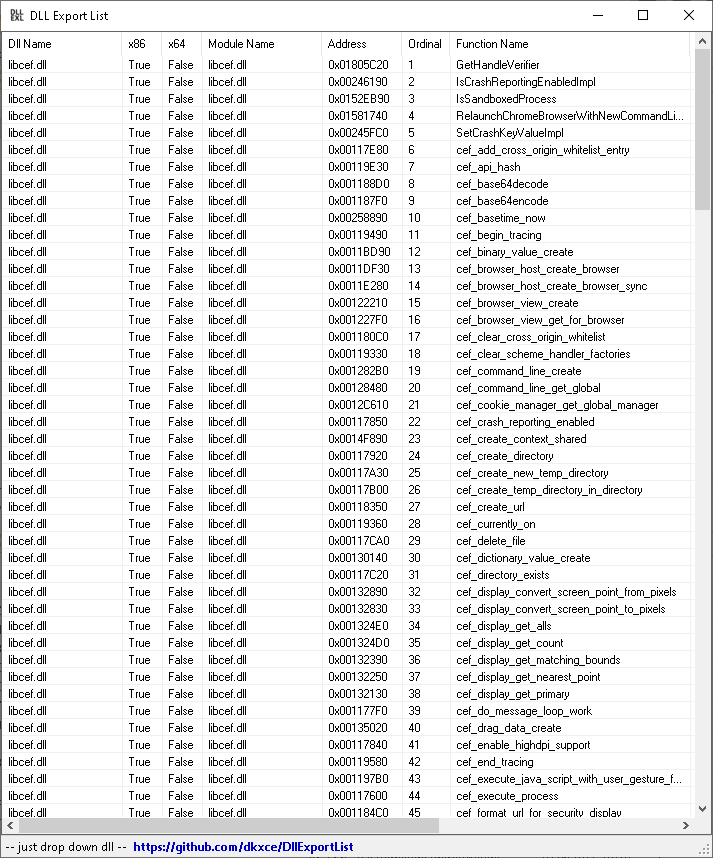

# DllExportList

View DLL Export Functions List with Names and Addresses

   

**Alternatives**:    
- [DllExportViewer](https://github.com/dkxce/DllExportViewer) by [jNizM](https://github.com/jNizM/DllExport)
- [DLL Export Viewer](http://www.nirsoft.net/utils/dll_export_viewer.html) by [NirSoft](http://www.nirsoft.net/)
- [Dependency Walker](http://www.dependencywalker.com/)
